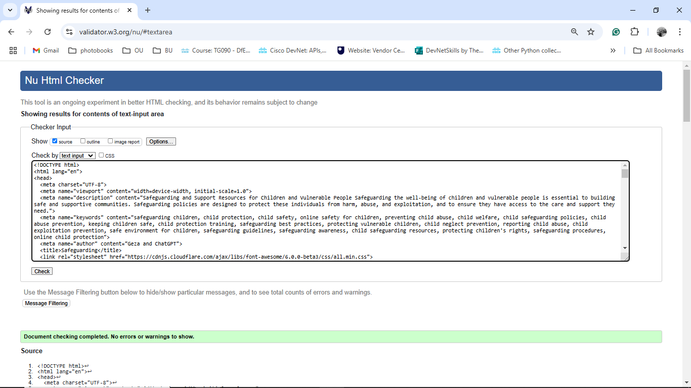

# Safeguarding

## Overview

This project is a web platform designed to provide safeguarding and support resources for children and vulnerable people. The goal is to create a comprehensive resource hub that brings together essential links to safeguarding resources, including detailed guidelines, emergency contacts, and access to a variety of support services.

## index.html

The `index.html` file is the main entry point of the website. It includes several sections that provide information and resources related to safeguarding:

### Sections

1. **Header**
   - Contains the navigation bar with links to different sections of the page.
   - Includes the hero section with a background image and introductory text about safeguarding.

2. **About**
   - Provides an overview of the platform's purpose and goals.
   - Includes an embedded YouTube video explaining safeguarding.

3. **Resources and Support**
   - Lists various resources and support options available for safeguarding.
   - Each resource is presented as a card with an image, title, description, and a link to the resource.

4. **Contact**
   - Provides contact information and a form for users to reach out for support.
   - The form includes fields for full name, phone number, email, and a message.

5. **Footer**
   - Contains social media links and contact information.
   - Displays copyright information.

### Key Features

- **Responsive Design**: The layout is responsive and adapts to different screen sizes using Bootstrap.

**Laptop View**:

**Mobile View**:

- **Custom Styles**: Custom CSS styles are defined in `assets/css/styles.css` to enhance the visual appearance of the website.
- **Interactive Elements**: Includes a Bootstrap modal to provide additional information about safeguarding.

### External Resources

- **Bootstrap**: Used for responsive design and styling.
- **Font Awesome**: Used for social media icons in the footer.
- **Google Fonts**: Custom fonts are imported for a better visual appeal.

## gdpr

The `gdpr` section provides information about the General Data Protection Regulation (GDPR) and how it applies to the safeguarding platform. It includes details on data protection policies, user rights, and contact information for data protection inquiries.

### How to Use

1. Open `index.html` in a web browser to view the website.
2. Navigate through different sections using the navigation bar.
3. Explore the resources and support options available.
4. Use the contact form to reach out for support or inquiries.

### Image Credits

The pictures used in this project were generated with Adobe AI.

### Test Results

Google Lighthouse

CSS Validator

HTML Validator

### Website responsive test

Moblie:

Tablet:

Laptop:

## Contributing

If you would like to contribute to this project, please fork the repository and submit a pull request with your changes. We welcome contributions that improve the functionality and usability of the platform.

## License

This project is licensed under the MIT License. See the [LICENSE](LICENSE) file for more details.

[def]: readme_pics/Mobile_wireframe.png